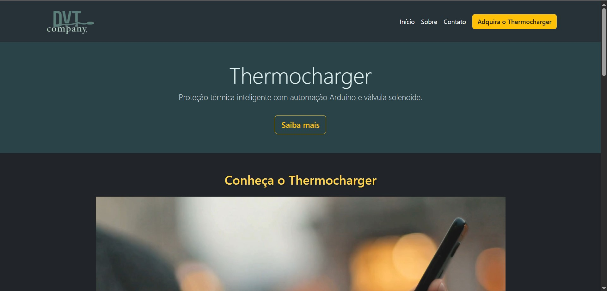

# Thermo Charge — Projeto Semestral SENAI



[]()
[]()
[]()

## Acesse o projeto online

[](https://vinicius3442.github.io/Thermocharge)

---

## Sobre este projeto

Site criado para o projeto semestral de Desenvolvimento de Sistemas do SENAI, que consiste em um sistema de **monitoramento de temperatura** e **acionamento de solenoide** para controle térmico de carregadores de celular. O hardware foi desenvolvido com **Arduino** (linguagem C++) e integrado a uma interface web simples com **HTML5**, **CSS3**, **Bootstrap** e **JavaScript**.

---

## Tecnologias utilizadas

<p align="left">
  
  
  
  
  
  
</p>

---

## Funcionalidades

-  Monitoramento contínuo da temperatura via sensor DHT11.
- Indicação visual por LEDs de estados: Normal, Atenção e Perigo.
- Alerta sonoro com buzzer em estado de Perigo.
- Ativação de solenoide para bloqueio do carregamento.
- Modo Manual/Automático via botão físico (override).

---

## Sobre o Projeto

Este site foi desenvolvido como parte do projeto semestral do curso Técnico em Desenvolvimento de Sistemas no SENAI. A proposta foi criar uma **loja virtual para uma empresa fictícia**, com foco em simular uma experiência completa de navegação, compra e finalização de pedido.

O projeto integra diversas tecnologias para simular o fluxo de um e-commerce moderno:

- **HTML5, CSS3 e Bootstrap** para a estrutura, responsividade e estilo visual.
- **JavaScript puro** para funcionalidades dinâmicas, manipulação de DOM e controle do carrinho.
- **SweetAlert2 (Swal)** para criação de alertas personalizados e modais interativos, simulando as etapas de compra, confirmação e feedbacks visuais.
- **API pública de CEP (ViaCEP)** integrada ao formulário de checkout, permitindo o preenchimento automático de endereço com base no CEP informado pelo usuário.

Embora não haja backend real nem transações de pagamento, o projeto simula de forma convincente o comportamento de uma loja funcional, desde a vitrine até o "pedido confirmado", focando em **UX (experiência do usuário)** e **integração com APIs externas**.

---

## Seção Arduino (Hardware)

### Foto do Projeto Montado

 <!-- substitua pela imagem real -->

### Visão Geral

O circuito foi construído com os seguintes componentes:
- Sensor de temperatura e umidade **DHT11**
- 3 LEDs (Verde, Amarelo, Vermelho)
- **Buzzer** para alerta sonoro
- **Servo motor** simulando o mecanismo de bloqueio
- Botão para ativação do modo manual

O microcontrolador interpreta os dados do DHT11 e decide, com base na temperatura:
- A cor do LED aceso
- A ativação do buzzer
- A posição do servo motor (0° ou 90°)
- Alternância entre modo **Automático** e **Manual**

---

### Código Fonte (Arduino/C++)

```cpp
#include <DHT.h>
#include <Servo.h>

#define DHTPIN 2
#define DHTTYPE DHT11
DHT dht(DHTPIN, DHTTYPE);

const int ledVerde = 3;
const int ledAmarelo = 4;
const int ledVermelho = 5;
const int buzzer = 6;

Servo servo;
const int servoPin = 7;
const int buttonPin = 8;

bool overrideManual = false;
bool lastButtonState = LOW;
unsigned long lastDebounceTime = 0;
const unsigned long debounceDelay = 50;

float temperatura = 0;
String estado = "Normal";
String modo = "Auto";

void setup() {
  Serial.begin(9600);
  dht.begin();
  pinMode(ledVerde, OUTPUT);
  pinMode(ledAmarelo, OUTPUT);
  pinMode(ledVermelho, OUTPUT);
  pinMode(buzzer, OUTPUT);
  pinMode(buttonPin, INPUT_PULLUP);

  servo.attach(servoPin);
  servo.write(0);

  Serial.println("Sistema iniciado.");
}

void loop() {
  bool reading = digitalRead(buttonPin);
  if (reading != lastButtonState) {
    lastDebounceTime = millis();
  }

  if ((millis() - lastDebounceTime) > debounceDelay) {
    if (reading == LOW && lastButtonState == HIGH) {
      overrideManual = !overrideManual;
      modo = overrideManual ? "Manual" : "Auto";
    }
  }

  lastButtonState = reading;
  temperatura = dht.readTemperature();

  if (isnan(temperatura)) {
    Serial.println("Erro ao ler DHT11");
    return;
  }

  if (!overrideManual) {
    if (temperatura < 25) {
      setEstado("Normal");
    } else if (temperatura < 30) {
      setEstado("Atenção");
    } else {
      setEstado("Perigo");
    }
  }

  Serial.print("Temperatura: ");
  Serial.print(temperatura);
  Serial.print(" °C | Estado: ");
  Serial.print(estado);
  Serial.print(" | Modo: ");
  Serial.println(modo);

  delay(1000);
}

void setEstado(String novoEstado) {
  estado = novoEstado;
  digitalWrite(ledVerde, LOW);
  digitalWrite(ledAmarelo, LOW);
  digitalWrite(ledVermelho, LOW);
  digitalWrite(buzzer, LOW);
  servo.write(0);

  if (estado == "Normal") {
    digitalWrite(ledVerde, HIGH);
  } else if (estado == "Atenção") {
    digitalWrite(ledAmarelo, HIGH);
  } else if (estado == "Perigo") {
    digitalWrite(ledVermelho, HIGH);
    digitalWrite(buzzer, HIGH);
    servo.write(90);
  }
}
```
## Autores

### Vinicius Montuani  
[](https://github.com/vinicius3442)  
[](https://linkedin.com/in/vinicius-montuani)

---

### Vinicius Queiroz  
[](#)  
[](#)

---

### Vitor Gaspar  
[](#)  
[](#)

---

### Davi  
[](#)  
[](#)

---

### Thomas  
[](#)  
[](#)

